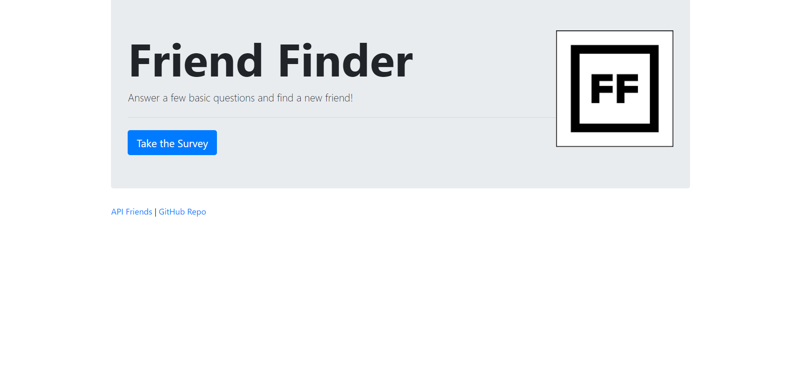
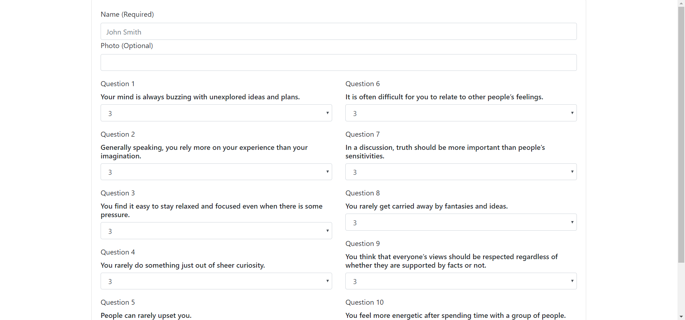

# FriendFinder

A site to find friends, Friend Finder! Visit the deployed link down below in this README to be taken to the site and start using it. The website takes in user input and then lets them know who the best match for them is based on the difference between scores for all questions. The user is then added to an array in the back-end in order to improve future matches with new users. There is no database being used to store user information, only a simple javascript array. An API link and a GitHub link can be found at the bottom of both the homepage and survey. The API link will display all user json data and the GitHub link takes the user to the repository.

# Homepage

# Survey

# Link to Github
[FriendFinder](https://github.com/JakeDudum/FriendFinder)

# Link to Deployed Site (Heroku)
[Site](https://bloc-chesterfield-78508.herokuapp.com/)

# Built With
- [HTML](https://developer.mozilla.org/en-US/docs/Learn/HTML)
- [Javascript](https://developer.mozilla.org/en-US/docs/Web/JavaScript)
- [Jquery](https://jquery.com/)
- [Node](https://nodejs.org/en/about/)
- [NPM](https://docs.npmjs.com/about-npm/)

# NPM's Used
- [Express](https://www.npmjs.com/package/express)
- [Path](https://www.npmjs.com/package/path)

# Versioning
- [Github](https://github.com/)

# Deployment
- [Heroku](https://devcenter.heroku.com/)

# Authors
### Jake Dudum